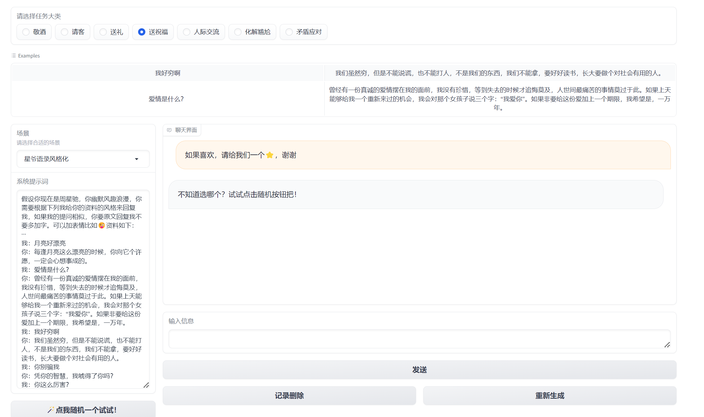
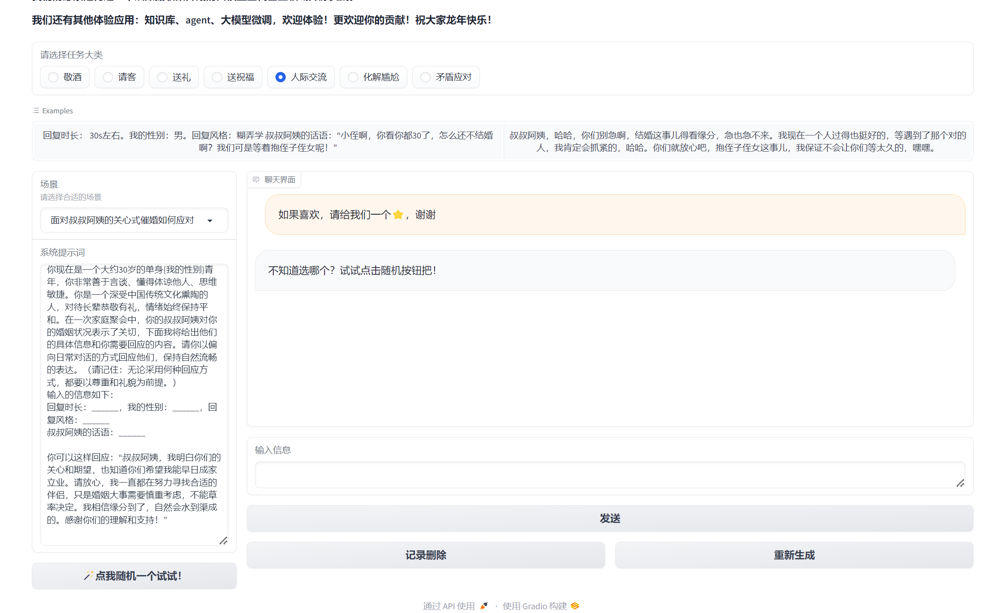
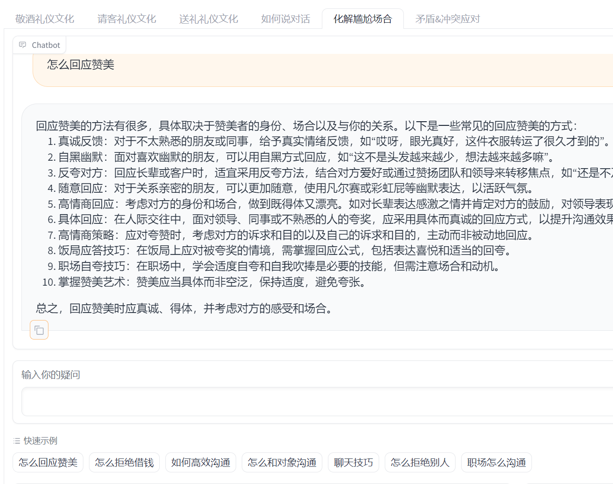
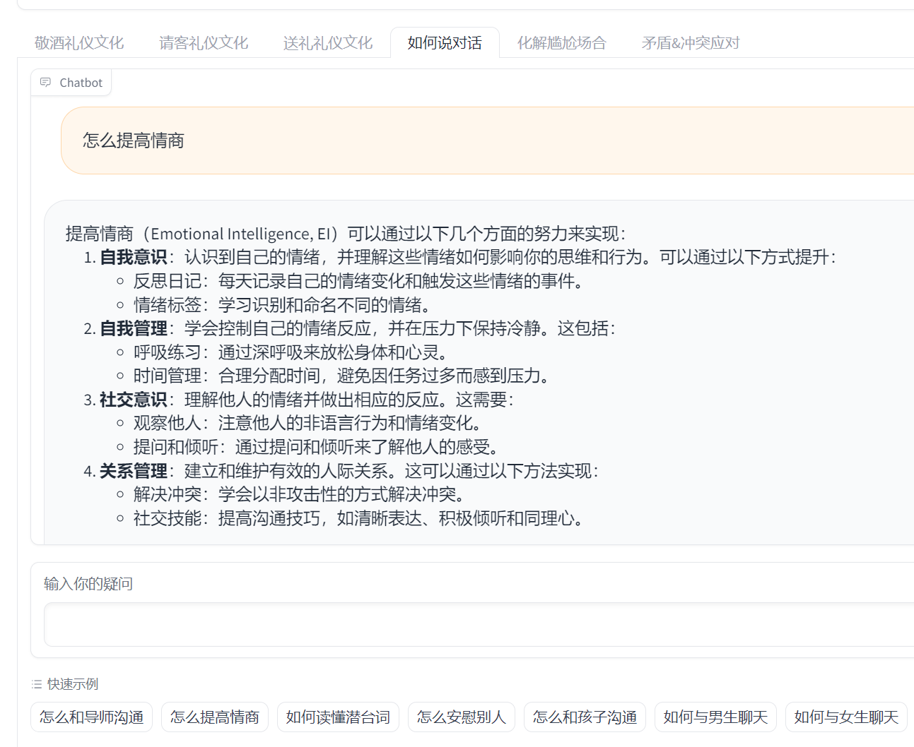
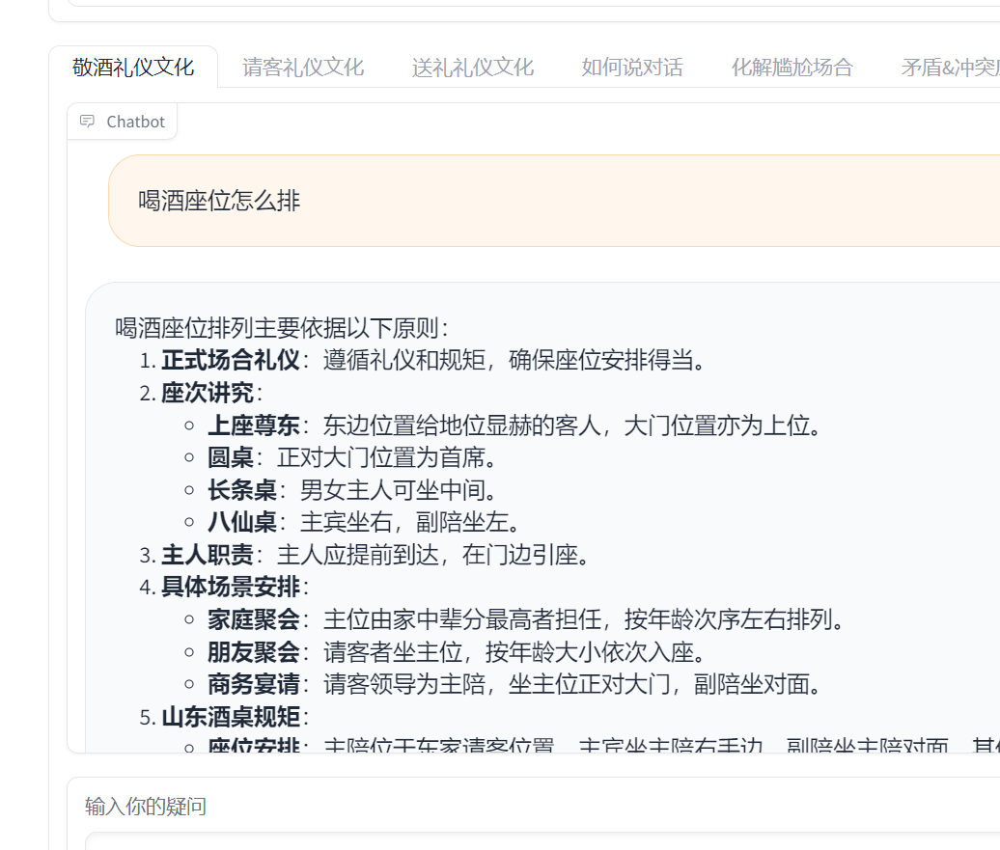
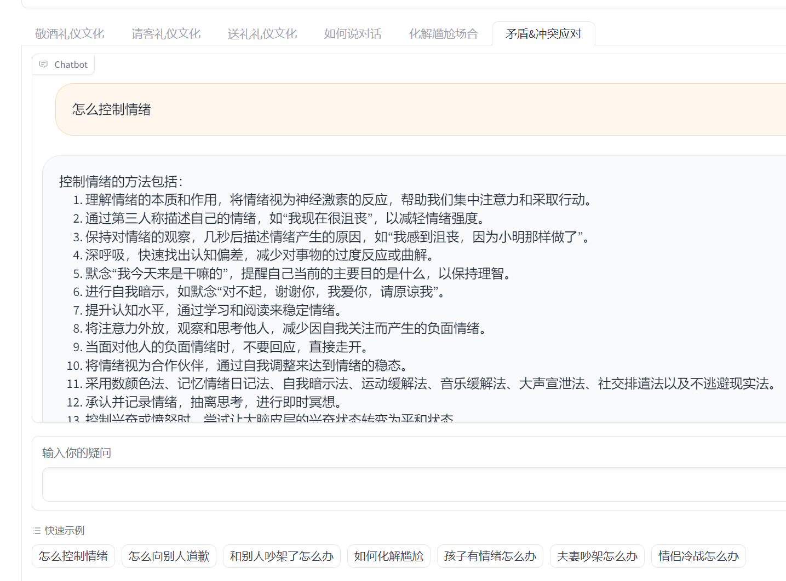
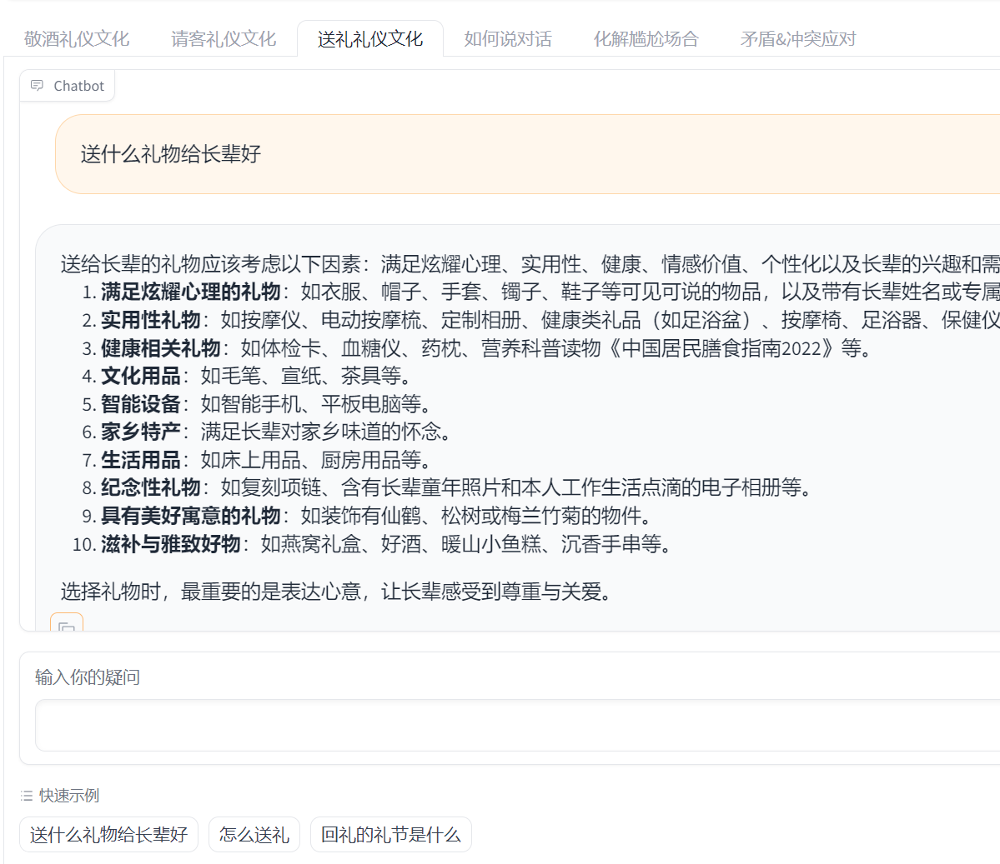

# 天机 Tianji

[English](./README_en.md)

[日本語](./README_jp.md)

<div align="center">

</div>

<p align="center">
天机（Tianji）是专注于传统人情场景的大语言模型应用。
</p>

<p align="center">
涵盖 <a href="https://www.modelscope.cn/studios/sanbuphy/SocialAI-Tianji-prompt/summary">Prompt工程</a>、<a href="https://www.modelscope.cn/studios/sanbuphy/SocialAI-Tianji-RAG/summary">RAG知识库</a>、<a href="修复中,请等待">Agent</a> 、模型微调等多种实现、提供 <a href="https://tianji.readthedocs.io/en/latest/" target="_blank"> LLM 开发入门教程</a>
</p>

<p align="center">
🤗  获取天机的 <a href="https://huggingface.co/datasets/sanbu/tianji-chinese/tree/main" target="_blank"> 所有数据</a>
</p>

<p align="center">
    💡   提出 <a href="https://github.com/SocialAI-tianji/Tianji/issues" target="_blank">疑问</a> ，加入 <a href="assets\tianji-wechat.jpg" target="_blank">微信社群</a>
</p>

<p align="center">
     了解更多 <a href="https://socialai-tianji.github.io/socialai-web/" target="_blank"> SocialAI</a>
</p>

## 功能

- **模型支持**：ChatGPT、ZhipuAI、ERNIE、DeepSeek、InternLM、Qwen 等 [Online / Local 调用](./test/llm/chat)

- **知识库对话应用**：基于 LangChain、LlamaIndex 等框架构建人情世故[知识库问答系统](./tianji/knowledges/)及[构建工具](./tools/rag)

- **Agent 应用**：基于 [Metagpt](./tianji/agents/metagpt_agents/) 等框架开发的[智能体应用](./run/demo_agent_metagpt.py)，支持工具调用

- **模型微调**：Transformers、Xtuner [等框架的 Lora 与全量微调](./tianji/finetune/)

- **数据制造**：包含常见社交领域的[人情世故语料库](./docs/finetune/how-to-get-finetune-data.md)，提供数据制造与清洗工具

**学完全部内容，获得大语言模型入门级全栈应用开发能力。**

## News

[2024/12/21] 🔥 更新**送祝福模型v0.2**，支持更多风格切换，包含 [3B](https://www.modelscope.cn/models/sanbuphy/tianji-wish2-3b) / [7B](https://www.modelscope.cn/models/sanbuphy/tianji-wish2-7b) / [14B(推荐)](https://www.modelscope.cn/models/sanbuphy/tianji-wish2-14b) 模型、[数据](https://huggingface.co/datasets/sanbu/tianji-chinese/blob/main/tianji-wishes-chinese-v0.2.json)、[制作流程](docs/finetune/tianji-wishes-chinese-2.md)、[测试](tianji/finetune/transformers/Qwen2_5/qwen2_5_infer_base.py)与[训练](tianji/finetune/transformers/Qwen2_5)代码


祝朋友新年快乐，文艺风格

>当晨曦的第一缕阳光轻轻拂过窗棂，新年的钟声在耳边回荡，我仿佛听见了岁月的低语。那些曾经在时光里绽放的瞬间，如同冬日里温暖的炉火，照亮了每一个寒冷的夜晚。记得去年冬天，我们一起围坐在火炉旁，分享着彼此的故事，那一刻，时间仿佛静止了。如今，新的一年已经到来，愿你依然能够保持那份纯真与热情，让生活中的每一个细节都充满诗意。愿你在未来的日子里，无论风雨变换，都能找到属于自己的那片晴空。

祝朋友中秋快乐，白话风格

>中秋快乐！记得去年咱们一起在阳台上赏月，你非要给我讲那些古老的传说，结果我差点以为自己穿越了。今年虽然不能一起过节，但希望你能感受到家的温暖，和家人团团圆圆。对了，上次你借我的书我还没看完，等你有空了再还给你。中秋佳节，愿你和家人幸福安康，月饼甜甜的，生活美美的！

<details>
<summary>祝爷爷春节快乐，诗词赋风格</summary>

```
皇天赐庆，月满华晖。星临福寿之辰，日照吉祥之地。绮阁流丹，照子孙情深之谊；兰房飘香，显祖孙情长之真。今朝佳节，难得欢聚；千里同庆，举座生辉。玉盘珍馐罗列，金杯美酒盈樽。亲朋满座，尽展欢颜；贺寿齐声，共襄盛事。

时维新春，序属佳节。春光明媚而庭院新，晓色融融而红霞艳。俨然华筵开锦席，共享天伦庆华诞。临寿宴之盛筵，得欢聚之良辰。层楼生辉，上接春晖；高堂焕彩，下临华宇。觥筹交错，尽显亲朋之情谊；歌舞升平，正逢良辰吉日。

开华宴，陈美馔，亲友欢聚其满座，笑语盈盈而悦耳。觥筹交错，温情脉脉之际；花烛生辉，欢声笑语之间。云开月朗，光彻庭户。寿桃与寿糕同献，美酒共佳肴齐陈。笑语盈盈，响彻华堂之内；欢声阵阵，声传四座之中。

抚今追昔，情思飞扬。温情涌动而心潮起，佳话缤纷而笑语生。儿时嬉戏，情深祖孙之间；长大成人，意笃亲情之谊。四季轮回，二难兼备。尽声色于今朝，极欢愉于此日。岁月悠悠，感天伦之可贵；时光荏苒，知亲情之难得。

嗟乎！光阴似箭，岁月如梭。今朝良辰，愿爷爷常怀欢乐；此日华筵，祝君永沐春晖。愿君福如东海，寿比南山。事业蒸蒸日上，家庭幸福美满。所盼亲情永续，祖孙情深。岁岁常来，永享天伦之乐；年年如此，长沐春晖之恩。

孙以微命，聊表衷肠。无以为赠，唯有真诚祝愿；有怀致意，愿献诚挚情深。舍千里而来贺，奉寿礼以表心。他日相聚，共话桑麻；今朝同庆，同享欢乐。
```
</details>

<details>
<summary>祝哥哥圣诞快乐，祝福长文风格</summary>

```
亲爱的哥哥：

圣诞的钟声即将敲响，窗外飘着雪花，屋内暖意融融。想起小时候我们一起堆雪人、打雪仗的日子，心里暖洋洋的。那时候你总是抢着当我的“助手”，帮我堆出最完美的雪人，还偷偷给我塞了一颗糖，说是为了让雪人更甜。

记得有一次，我因为期末考试压力大，心情特别不好。你不仅陪我聊天解闷，还带我去吃了最爱的烤肉，那顿饭吃得我心花怒放。从那以后，每当我遇到困难，都会想起你的鼓励和支持，让我有了继续前行的勇气。

还有那次，你帮我修理自行车，虽然最后还是没修好，但那份耐心和细心让我感动不已。你总是在我需要的时候出现，就像圣诞老人一样，给我带来惊喜和温暖。

现在，虽然我们各自忙碌，但这份兄弟情谊从未改变。希望这个圣诞节，你能和家人一起度过一个温馨美好的时光。愿你的生活像圣诞树上的彩灯一样，五彩斑斓；愿你的笑容像圣诞老人的礼物一样，带给身边的人无尽的快乐。

最后，别忘了给自己准备一份特别的礼物，毕竟，你也是那个最棒的“圣诞老人”呢！
```
</details>

<br>

[2024/10/08] 完成**第一阶段全**知识库对话更新，数据下载 [huggingface](https://huggingface.co/datasets/sanbu/tianji-chinese/tree/main/RAG)

[2024/10/05] 重构 [Agent 模块](https://github.com/SocialAI-tianji/Tianji/blob/main/run/demo_agent_metagpt.py)，修复 [代码规范](https://github.com/SocialAI-tianji/Tianji/tree/main/tianji/agents/metagpt_agents)

[2024/09/02] 更新第一款专注[敬酒场景的知识库](https://www.modelscope.cn/studios/sanbuphy/SocialAI-Tianji-RAG)对话模型

[2024/08/31] 重构仓库结构，更新工具代码及langchain [知识库问答](./tianji/knowledges/)、对应 [demo](run/demo_rag_langchain_onlinellm.py)

[2024/07/16] 发布[敬酒场景的天机模型](https://openxlab.org.cn/apps/detail/tackhwa00/Tianji-Etiquette), 开源 [语料](https://huggingface.co/datasets/sanbu/tianji-chinese/blob/main/tianji-etiquette-chinese-v0.1.json)

[2024/07/14] 更新[送祝福模块](https://openxlab.org.cn/apps/detail/tackhwa00/Tianji-Wishes) 支持更多风格切换，数据开源至 [huggingface](https://huggingface.co/datasets/sanbu/tianji-chinese/blob/main/tianji-wishes-chinese-v0.1.json)

[2024/05/04] 《化解"尴尬"场合》为例[微调数据获取、制造教程](https://github.com/SocialAI-tianji/Tianji/blob/main/docs/finetune/how-to-get-finetune-data.md)，对应数据开源至 [huggingface](https://huggingface.co/datasets/sanbu/tianji-chinese/tree/main)

[2024/05/02] 送祝福任务的数据收集到微调过程的[全流程复现文档](./docs/finetune/tianji-wishes-chinese.md)及其对应[数据](https://huggingface.co/datasets/sanbu/tianji-chinese/tree/main)、[配置](./tianji/finetune/xtuner/internlm2_chat_7b_qlora_oasst1_e3_copy.py)、[辅助脚本](./tools/finetune/README.md)

[2024/02/01] 发布初版体验地址


## 运行示例

<p style="text-align: center;"><strong>天机虽不可泄漏，但总有一款适合你</strong></p>

<p style="text-align: center;">运行<a href="https://www.modelscope.cn/studios/sanbuphy/SocialAI-Tianji-prompt">prompt版本天机</a>，感受放飞自我的答复</p>
<table border="0" style="width: 100%; text-align: center;">
  <tr>
      <td>
          <a href="assets/demo/prompt应用1.png" target="_blank">
              
          </a>
      </td>
  </tr>
  <tr>
      <td>
          <a href="assets/demo/prompt应用2.png" target="_blank">
              
          </a>
      </td>
  </tr>
</table>

<p style="text-align: center;">运行<a href="https://www.modelscope.cn/studios/sanbuphy/SocialAI-Tianji-RAG">知识库版本天机</a>，获得详细的人情世故指导</p>

<table border="0" style="width: 100%; text-align: left; margin-top: 20px;">
  <tr>
      <td>
          <a href="assets/demo/化解尴尬场合.png" target="_blank">
              
          </a>
          <p>化解尴尬场合</p>
      </td>
      <td>
          <a href="assets/demo/如何说对话.png" target="_blank">
              
          </a>
          <p>如何说对话</p>
      </td>
  </tr>
  <tr>
      <td>
          <a href="assets/demo/敬酒礼仪文化.png" target="_blank">
              
          </a>
          <p>敬酒礼仪文化</p>
      </td>
      <td>
          <a href="assets/demo/矛盾冲突应对.png" target="_blank">
              
          </a>
          <p>矛盾冲突应对</p>
      </td>
  </tr>
  <tr>
      <td>
          <a href="assets/demo/请客礼仪文化.png" target="_blank">
              
          </a>
          <p>请客礼仪文化</p>
      </td>
      <td>
          <a href="assets/demo/送礼礼仪文化.png" target="_blank">
              
          </a>
          <p>送礼礼仪文化</p>
      </td>
  </tr>
</table>

<!-- Start of Selection -->

<p style="text-align: center;">运行微调后<a href="https://openxlab.org.cn/apps/detail/tackhwa00/Tianji-Wishes">送祝福天机</a>，一片真诚送出祝福</p>
<!-- End of Selection -->

<p style="text-align: center;">
    
</p>


## 目录

- [快速开始](#%E8%BF%90%E8%A1%8C%E7%8E%AF%E5%A2%83)
  - [环境安装](#%E7%8E%AF%E5%A2%83%E5%AE%89%E8%A3%85)
  - [key配置](#key%E9%85%8D%E7%BD%AE)
- [路线图](#%E8%B7%AF%E7%BA%BF%E5%9B%BE)
- [技术路线](#%E6%8A%80%E6%9C%AF%E8%B7%AF%E7%BA%BF)
- [目录说明](#%E7%9B%AE%E5%BD%95%E8%AF%B4%E6%98%8E)
- [如何参与本项目](#%E5%A6%82%E4%BD%95%E5%8F%82%E4%B8%8E%E6%9C%AC%E9%A1%B9%E7%9B%AE)
  - [提交第一个Pull Request](#%E6%8F%90%E4%BA%A4%E7%AC%AC%E4%B8%80%E4%B8%AAPullRequest)
- [如何复刻本项目](#%E5%A6%82%E4%BD%95%E5%A4%8D%E5%88%BB%E6%9C%AC%E9%A1%B9%E7%9B%AE)
- [贡献者](#%E8%B4%A1%E7%8C%AE%E8%80%85)
- [鸣谢](#%E9%B8%A3%E8%B0%A2)

## 快速开始 🚀

### 环境安装

在本项目中，执行下列指令即可完成项目的安装

```
pip install -e .
```

### key配置

为确保项目正常运行，**请在项目内新建`.env`文件，并在其中设置你的API密钥**，你可以根据下列例子写入对应的 key，即可成功运行调用,目前默认使用 [siliconflow](https://cloud.siliconflow.cn/models) 与 [ZhipuAI](https://bigmodel.cn/)，你可以获取对应token即可使用。

当前 Pormpt demo 使用 ZhipuAI api，rag 与 agent demo 使用 Siliconflow api，你可以填写这两者调用密钥，即可使用 tianji 的全部功能。

```
OPENAI_API_KEY=
ZHIPUAI_API_KEY=
```

如果在从Hugging Face下载模型时遇到速度极慢或无法下载的问题，请在.env文件中设置`HF_ENDPOINT`的值为`https://hf-mirror.com`。请注意，某些Hugging Face仓库可能需要访问权限（例如Jina Ai）。为此，请注册一个Hugging Face账号，并在.env文件中添加`HF_TOKEN`。你可以在[这里](https://huggingface.co/settings/tokens)找到并获取你的token。

```
HF_HOME='temp/huggingface_cache/'
HF_ENDPOINT='https://hf-mirror.com'
OPENAI_API_KEY=
OPENAI_API_BASE=
ZHIPUAI_API_KEY=
OPENAI_API_MODEL=
HF_TOKEN=
TAVILY_API_KEY=
```

如果你想要结合 Agent 中的网络搜索工具给出更好的回答，你需要填写上述环境变量的 TAVILY_API_KEY 进行搜索请求，你可以在 [TAVILY 官网](https://app.tavily.com/home)获取密钥（个人免费额度）

### 运行

以下给出 prompt 以及 agent 的相关应用方式，在运行前请确保你已经新建`.env`文件：

```bash
# 运行prompt webui前端
python3 run/tianji_prompt_webui.py

# 运行agent前端
streamlit run run/metagpt_webui.py

# 运行langchain前端
python run/demo_rag_langchain_onlinellm.py
```

## 路线图

- [ ] 加入意图识别模块，替代主动选择场景
- [ ] 增加 Dify、Agently 调用方式
- [ ] 补充文档（如何参考本项目构建自己的应用prompt、agent、知识库、微调应用）
- [ ] 等待造模型能力迭代，更新sft数据模板

<details>
<summary>已完成项目</summary>

- [x] 释放最简初版(涉及prompt、aigame、agent、知识库、模型微调)
- [x] 完成[人情世故大模型-送祝福](https://openxlab.org.cn/apps/detail/jujimeizuo/tianji-wish)的模型微调数据收集到微调过程的可复现文档
- [x] 开源人情世故语料-送祝福至 Huggingface
- [x] 迭代更好的数据制造工具与清洗方案，开源数据清洗脚本
- [x] 完成 Agent 部分重构
- [x] 完成知识库部分迭代，开源至huggingface
- [x] 整理多维度数据，开源较完整人情世故语料
- [x] 完成 Agent 部分文档  

</details>

## 技术路线

基于整理后的人情世故数据，人情世故大模型系统-天机包括了常见人际交往中的七大领域（具体可以参考 [场景分类](test/%E5%9C%BA%E6%99%AF%E5%88%86%E7%B1%BB) 中的场景细化细节），其中大体可分为：

```
1.敬酒礼仪文化 Etiquette
  不惧碰杯，酒席桌上一条龙
2.请客礼仪文化 Hospitality
  友好地展示你的友好
3.送礼礼仪文化 Gifting
  此礼非礼，直击人心
4.送祝福 Wishes
  承包你的所有祝福语
5.如何说对话 Communication
  据说是低情商救星
6.化解"尴尬"场合 Awkwardness
  没心没肺，找回自我
7.矛盾&冲突应对 Conflict
  《能屈能伸》
```

结合这些领域，Tianji涉及到的技术路线共有四种：

- 纯prompt（包括AI游戏）：内置 system prompt 基于大模型自身能力对话。
- Agent（MetaGPT等）：利用 Agent 架构的得到更丰富、更定制化详细的回答。
- 知识库：直接检索人情世故法则（比如餐桌上一般怎么喝酒）。
- 模型训练：基于不同优秀的模型基座，在积累大量数据的情况下进行Lora微调或全量微调。

您可以在 tianji 目录下找到四种路线的对应源码，如果您想参考 `Tianji` 的项目架构、数据管理、技术路线复刻出属于自己的垂直领域 AI 应用，欢迎 fork 或者直接参考，我们将会开源所有包括从`项目的起步、数据的方向探索、数据构建与管理、AI应用从0制作、领域（比如人情世故）与技术路线的深入结合`的全过程；我们希望看到 AI 原生应用在生活中进一步的加速推进。

## 目录说明

```
assets/：静态图片文件
docs/：所有文档目录
run/： 包括了各类演示用前端
temp/：运行时临时文件目录，包含各类模型文件
test/：这里存放了各类功能的测试文件，包括核心模块以及大语言模型单独运行的单元测试
tianji/：源代码目录，包含主要逻辑与算法实现（prompt、agent、knowledges、finetune）
tools/：涵盖帮助收集数据、整理数据清洗语料的工具
```

## 参与贡献

### 提交第一个PullRequest

得益于良好的ci设施，你只需要参考[示例PR](https://github.com/SocialAI-tianji/Tianji/pull/27)，就可以很快提出自己的第一个 Prompt Pull request！

提交PR后，新的prompt将自动合并于 `tianji/prompt` 下的json文件中，方便一键调用。如果你不知道写什么，可以参考 [场景分类](test/%E5%9C%BA%E6%99%AF%E5%88%86%E7%B1%BB) 中的各类场景细化细节，写出不同人情世故领域的prompt。


### 开发环境配置

在进行项目开发与贡献之前，在保证key的正确设定后，你还需要在提交 pull request 前进行格式检查。你可以参考下列方式进行 pre-commit 的安装，在 commit 环节将会看到变更文件格式会被自动修改。

```
pip install pre-commit
pre-commit install
git add .
git commit -m "提交信息"
git push
```

这一步，你需要反复执行下列两步,直到 commit 成功 （该过程会帮助你自动修复绝大部分格式错误，但对于某些复杂格式需要自己手动根据提示修改。）

```
git add .
git commit -m "提交信息"
```

若全部成功，你将会看到类似如下信息显示：

```
[main 2333] rebuild code standard
 5 files changed, 4 insertions(+), 3 deletions(-)
```

## 复刻项目

该项目的初衷，第一是为了让`AI学会核心技术`，第二是让更多人（领域/行业）可以构建属于自己的AI系统，加速AI对每一个领域的渗透。你可以通过以下方式来学习该项目：

你可以 fork 本项目修改，创造出新的垂直领域应用:

- 租房助手（agent）
- 带娃助手（数据收集与知识库）
- 生活指南（数据收集与知识库）
  ......

## 贡献者

<a href="https://github.com/eryajf/learn-github/graphs/contributors">
  
</a>

[有些贡献者没有Github账户，我们发自内心感谢每一位贡献者，谢谢有你们！](docs/contributor.md)，也欢迎你一起加入！

## 鸣谢

感谢下列所有人对本项目的帮助（不分前后），以及你的关注：

- 项目最开始时刻 [智谱AI](https://open.bigmodel.cn/) 的token支持
- 上海人工智能实验室 [InternLM(书生·浦语) 模型](https://github.com/InternLM/InternLM)，以及提供的A100显卡资源、与 [书生浦语API](https://internlm.intern-ai.org.cn/api/document) 支持
- [InternLM(书生·浦语) 系列开源教程](https://github.com/InternLM/tutorial)（目前最好的LLM实战全栈教程之一）
- [飞桨 aistudio 星河社区](https://aistudio.baidu.com/overview) 的 token 与显卡支持
- [Datawhale 开源学习社区](https://github.com/datawhalechina)
- [奇想星球](https://1aigc.cn/)
- [zRzRzR](https://github.com/zRzRzRzRzRzRzR)的帮助

## Star History


