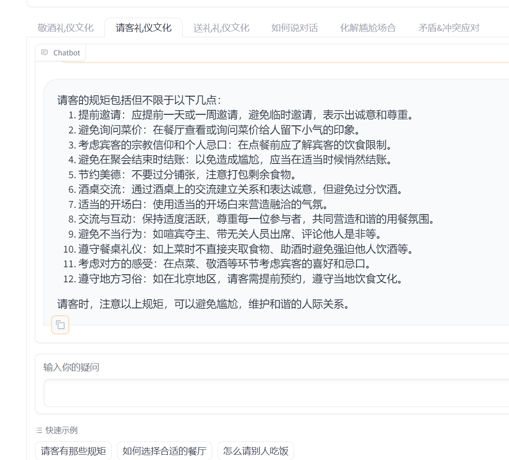

# 天机 Tianji

[English](./README_en.md)

[日本語](./README_jp.md)

<div align="center">

<!-- Start of Selection -->
</div>
<p align="center">
🍵 在线体验懂人情世故的天机<a href="http://120.76.130.14:6006/prompt/">prompt应用</a>、<a href="http://120.76.130.14:6006/knowledges/">知识库应用</a>、<a href="http://120.76.130.14:6005/">Agent应用</a>
</p>
<p align="center">
在上海 AILab OpenXLab 在线体验人情世故微调模型：<a href="https://openxlab.org.cn/apps/detail/tackhwa00/Tianji-Wishes">送祝福模块</a>、<a href="https://openxlab.org.cn/apps/detail/tackhwa00/Tianji-Etiquette">敬酒礼仪文化</a>
</p>
<!-- End of Selection -->

<p align="center">
📚 查看  <a href="docs" target="_blank">使用文档</a>
</p>

<p align="center">
🍓 在 🤗 huggingface 获取天机的 <a href="https://huggingface.co/datasets/sanbu/tianji-chinese/tree/main" target="_blank"> 所有数据</a>
</p>

<p align="center">
    💡  有疑问或功能请求，欢迎 <a href="https://github.com/SocialAI-tianji/Tianji/issues" target="_blank">创建一个 issue</a> ，或者加入我们的 <a href="assets\tianji-wechat.jpg" target="_blank">微信社区群</a>
</p>

<p align="center">
    对标 OpenAI 的  <a href="https://socialai-tianji.github.io/socialai-web/" target="_blank">SocialAI 首页</a>
</p>

## 📰 News

🔥🔥 **News**: `2024.10.08`: 我们完成了**第一阶段所有**知识库对话的更新，数据更新至 [huggingface](https://huggingface.co/datasets/sanbu/tianji-chinese/tree/main/RAG),你可以直接在该[链接](http://120.76.130.14:6006/knowledges/)进行体验。

🔥 **News**: `2024.10.05`: 我们重构了天机的[Agent 模块](https://github.com/SocialAI-tianji/Tianji/blob/main/run/demo_agent_metagpt.py)，加入网络搜索功能及功能可配置参数表，[具体可见源码](https://github.com/SocialAI-tianji/Tianji/tree/main/tianji/agents/metagpt_agents)。

🔥 **News**: `2024.09.02`: 我们更新了第一款专注[敬酒场景的知识库](http://120.76.130.14:6006/knowledges/)对话模型

🔥 **News**: `2024.08.31`: 我们重构了仓库组织结构，更新了相关工具代码以及README。彻底更新了 langchain [知识库问答](./tianji/knowledges/) 相关内容以及对应 [demo](run/demo_rag_langchain_onlinellm.py)，让项目更适合一键学习使用。

🔥**News**: `2024.07.16`: 我们发布了第一款们发布了第一款专注[敬酒场景的天机模型](https://openxlab.org.cn/apps/detail/tackhwa00/Tianji-Etiquette), 对应[敬酒语料](https://huggingface.co/datasets/sanbu/tianji-chinese/blob/main/tianji-etiquette-chinese-v0.1.json)

🔥**News**: `2024.07.14`: 更新了新版的[送祝福模块](https://openxlab.org.cn/apps/detail/tackhwa00/Tianji-Wishes) 支持更多风格切换，数据已开源至 [huggingface](https://huggingface.co/datasets/sanbu/tianji-chinese/blob/main/tianji-wishes-chinese-v0.1.json)

🔥**News**: `2024.05.04`: 我们发布了以《化解"尴尬"场合》为例的[微调数据获取、制造教程](https://github.com/SocialAI-tianji/Tianji/blob/main/docs/finetune/how-to-get-finetune-data.md)，对应数据开源至 [huggingface](https://huggingface.co/datasets/sanbu/tianji-chinese/tree/main)

🔥**News**: `2024.05.02`: 我们发布了有关人情世故大模型-送祝福的数据收集到微调过程的[全流程可复现文档](./docs/finetune/tianji-wishes-chinese.md)及其对应[数据](https://huggingface.co/datasets/sanbu/tianji-chinese/tree/main)、[配置](./tianji/finetune/xtuner/internlm2_chat_7b_qlora_oasst1_e3_copy.py)、[辅助脚本](./tools/finetune/README.md)

🍵 **News**: `2024.02.01`: 🧑‍🚀 我们发布了有关 [prompt](http://120.76.130.14:6006/prompt/)、[Agent应用](http://120.76.130.14:6005/)、知识库x、[模型微调(基于InternLM2)](https://openxlab.org.cn/apps/detail/tackhwa00/Tianji-Wishes)的初版体验地址，将仓库转为开放。


## ⭐ 运行示例

<p style="text-align: center;"><strong>天机虽不可泄漏，但总有一款适合你</strong></p>

<p style="text-align: center;">运行<a href="http://120.76.130.14:6006/prompt/">prompt版本天机</a>，感受放飞自我的答复</p>

<table border="0" style="width: 100%; text-align: center;">
  <tr>
      <td>
          
      </td>
      <td>
          
      </td>
  </tr>
</table>

<p style="text-align: center;">运行<a href="http://120.76.130.14:6006/knowledges/">知识库版本天机</a>，获得详细的人情世故指导</p>

<table border="0" style="width: 100%; text-align: left; margin-top: 20px;">
  <tr>
      <td>
          
          <p>化解尴尬场合</p>
      </td>
      <td>
          
          <p>如何说对话</p>
      </td>
      <td>
          
          <p>敬酒礼仪文化</p>
      </td>
  </tr>
  <tr>
      <td>
          
          <p>矛盾冲突应对</p>
      </td>
      <td>
          
          <p>请客礼仪文化</p>
      </td>
      <td>
          
          <p>送礼礼仪文化</p>
      </td>
  </tr>
</table>

<!-- Start of Selection -->
<p style="text-align: center;">运行微调后<a href="https://openxlab.org.cn/apps/detail/tackhwa00/Tianji-Wishes">送祝福天机</a>，一片真诚送出祝福</p>
<!-- End of Selection -->

<p style="text-align: center;">
    
</p>


## 你将在该项目中学会 🍉

**学完全部内容，你将获得大语言模型入门级全栈应用开发能力。**

- **不同LLM的部署与使用**: 实现 `Zhipuai,Ernie,Deepseek,Transformers` 等在线或本地模型的[快速使用](test/llm).

- **多样化LLM应用制作**: 包括构建 [prompt工程](./tianji/prompt/gpt_prompt/) 对话[大模型应用](./run/tianji_prompt_webui.py)、制作 [AI 游戏](./tianji/prompt/aigame/zhipu/)（类似哄哄模拟器）应用、基于 [metagpt](./tianji/agents/metagpt_agents/) 构建[智能体应用](./run/metagpt_webui.py)以及从零构建一个[知识库对话应用](./tianji/knowledges/)，支持 `LangChain, LlamaIndex` 多种 RAG 框架.

- **从数据到微调全流程**: 包含[数据制造](./docs/finetune/how-to-get-finetune-data.md)、[模型微调](./docs/finetune/how-to-get-finetune-data.md)环节,快速入门制作属于自己的大语言模型, 支持 `Transformers, Xtuner` 框架 Lora与全量微调.

## 目录

- [快速开始](#%E8%BF%90%E8%A1%8C%E7%8E%AF%E5%A2%83)
  - [环境安装](#%E7%8E%AF%E5%A2%83%E5%AE%89%E8%A3%85)
  - [key配置](#key%E9%85%8D%E7%BD%AE)
- [路线图](#%E8%B7%AF%E7%BA%BF%E5%9B%BE)
- [技术路线](#%E6%8A%80%E6%9C%AF%E8%B7%AF%E7%BA%BF)
- [目录说明](#目录说明)
- [如何参与本项目](#%E5%A6%82%E4%BD%95%E5%8F%82%E4%B8%8E%E6%9C%AC%E9%A1%B9%E7%9B%AE)
  - [提交第一个PullRequest](#提交第一个PullRequest)
- [如何复刻本项目](#%E5%A6%82%E4%BD%95%E5%A4%8D%E5%88%BB%E6%9C%AC%E9%A1%B9%E7%9B%AE)
- [贡献者](#%E8%B4%A1%E7%8C%AE%E8%80%85)
- [鸣谢](#%E9%B8%A3%E8%B0%A2)

## 快速开始 💫

### 环境安装

在本项目中，执行下列指令即可完成项目的安装

```
pip install -e .
```

### key配置

为确保项目正常运行，**请在项目内新建`.env`文件，并在其中设置你的API密钥**，你可以根据下列例子写入对应的 key，即可成功运行调用,目前默认使用 zhipuai，你可以仅写入`ZHIPUAI_API_KEY`即可使用。

```
ZHIPUAI_API_KEY=
```

如果在从Hugging Face下载模型时遇到速度极慢或无法下载的问题，请在.env文件中设置`HF_ENDPOINT`的值为`https://hf-mirror.com`。请注意，某些Hugging Face仓库可能需要访问权限（例如Jina Ai）。为此，请注册一个Hugging Face账号，并在.env文件中添加`HF_TOKEN`。你可以在[这里](https://huggingface.co/settings/tokens)找到并获取你的token。

```
HF_HOME='temp/huggingface_cache/'
HF_ENDPOINT='https://hf-mirror.com'
OPENAI_API_KEY=
OPENAI_API_BASE=
ZHIPUAI_API_KEY=
BAIDU_API_KEY=
OPENAI_API_MODEL=
HF_TOKEN=
```

### 运行

以下给出 prompt 以及 agent 的相关应用方式，在运行前请确保你已经新建`.env`文件：

```bash
# 运行prompt webui前端
python3 run/tianji_prompt_webui.py

# 运行agent前端
streamlit run run/metagpt_webui.py

# 运行langchain前端
python run/demo_rag_langchain_onlinellm.py
```

### 开发环境配置

在进行项目开发与贡献之前，在保证key的正确设定后，你还需要在提交 pull request 前进行格式检查。你可以参考下列方式进行 pre-commit 的安装，在 commit 环节将会看到变更文件格式会被自动修改。

```
pip install pre-commit
pre-commit install
git add .
git commit -m "提交信息"
git push
```

这一步，你需要反复执行下列两步,直到 commit 成功 （该过程会帮助你自动修复绝大部分格式错误，但对于某些复杂格式需要自己手动根据提示修改。）

```
git add .
git commit -m "提交信息"
```

若全部成功，你将会看到类似如下信息显示：

```
[main 2333] rebuild code standard
 5 files changed, 4 insertions(+), 3 deletions(-)
```

## 路线图

- \[x\] 释放最简初版(涉及prompt、aigame、agent、知识库、模型微调)
- \[x\] 完成[人情世故大模型-送祝福](https://openxlab.org.cn/apps/detail/jujimeizuo/tianji-wish)的模型微调数据收集到微调过程的可复现文档
- \[x\] 开源人情世故语料-送祝福至huggingface
- \[x\] 迭代更好的数据制造工具与清洗方案，开源数据清洗脚本
- \[x\] 完成 Agent 部分重构
- \[x\] 完成知识库部分迭代，开源至huggingface
- \[x\] 整理多维度数据，开源较完整人情世故语料
- \[ \] 加入意图识别模块，替代主动选择场景
- \[ \] 完成 Agent 部分文档
- \[ \] 补充文档（如何参考本项目构建自己的应用prompt、agent、知识库、微调应用）

## 技术路线

基于整理后的人情世故数据，人情世故大模型系统-天机包括了常见人际交往中的七大领域（具体可以参考 [场景分类](test/%E5%9C%BA%E6%99%AF%E5%88%86%E7%B1%BB) 中的场景细化细节），其中大体可分为：

```
1.敬酒礼仪文化 Etiquette
  不惧碰杯，酒席桌上一条龙
2.请客礼仪文化 Hospitality
  友好地展示你的友好
3.送礼礼仪文化 Gifting
  此礼非礼，直击人心
4.送祝福 Wishes
  承包你的所有祝福语
5.如何说对话 Communication
  据说是低情商救星
6.化解"尴尬"场合 Awkwardness
  没心没肺，找回自我
7.矛盾&冲突应对 Conflict
  《能屈能伸》
```

结合这些领域，Tianji涉及到的技术路线共有四种：

- 纯prompt（包括AI游戏）：内置 system prompt 基于大模型自身能力对话。
- Agent（MetaGPT等）：利用 Agent 架构的得到更丰富、更定制化详细的回答。
- 知识库：直接检索人情世故法则（比如餐桌上一般怎么喝酒）。
- 模型训练：基于不同优秀的模型基座，在积累大量数据的情况下进行Lora微调或全量微调。

您可以在 tianji 目录下找到四种路线的对应源码，如果您想参考 `Tianji` 的项目架构、数据管理、技术路线复刻出属于自己的垂直领域 AI 应用，欢迎 fork 或者直接参考，我们将会开源所有包括从`项目的起步、数据的方向探索、数据构建与管理、AI应用从0制作、领域（比如人情世故）与技术路线的深入结合`的全过程；我们希望看到 AI 原生应用在生活中进一步的加速推进。

## 目录说明

```
assets/：静态图片文件
docs/：所有文档目录
run/： 包括了各类演示用前端
temp/：运行时临时文件目录，包含各类模型文件
test/：这里存放了各类功能的测试文件，包括核心模块以及大语言模型单独运行的单元测试
tianji/：源代码目录，包含主要逻辑与算法实现（prompt、agent、knowledges、finetune）
tools/：涵盖帮助收集数据、整理数据清洗语料的工具
```


## 如何参与本项目

### 提交第一个PullRequest

得益于良好的ci设施，你只需要参考[示例PR](https://github.com/SocialAI-tianji/Tianji/pull/27)，就可以很快提出自己的第一个 Prompt Pull request！

提交PR后，新的prompt将自动合并于 `tianji/prompt` 下的json文件中，方便一键调用。如果你不知道写什么，可以参考 [场景分类](test/%E5%9C%BA%E6%99%AF%E5%88%86%E7%B1%BB) 中的各类场景细化细节，写出不同人情世故领域的prompt。

## 如何复刻本项目

该项目的初衷，第一是为了让`AI学会核心技术`，第二是让更多人（领域/行业）可以构建属于自己的AI系统，加速AI对每一个领域的渗透。你可以通过以下方式来学习该项目：

你可以 fork 本项目修改，创造出新的垂直领域应用:

- 租房助手（agent）
- 带娃助手（数据收集与知识库）
- 生活指南（数据收集与知识库）
  ......

## 贡献者

<a href="https://github.com/eryajf/learn-github/graphs/contributors">
  
</a>

[有些贡献者没有github账户，我们感谢其中的每一位贡献者！](docs/contributor.md)，也欢迎你一起加入！

## 鸣谢

感谢下列所有人对本项目的帮助，以及你的关注：

- 所有贡献者
- 项目最开始时刻 [智谱AI](https://open.bigmodel.cn/) 的token支持！
- 上海人工智能实验室 [InternLM(书生·浦语) 模型](https://github.com/InternLM/InternLM)，以及提供的A100显卡资源！
- [InternLM(书生·浦语) 系列开源教程（目前最好的LLM实战全栈教程之一）](https://github.com/InternLM/tutorial)
- [Datawhale 开源学习社区](https://github.com/datawhalechina)
- [奇想星球](https://1aigc.cn/)
- [zRzRzR](https://github.com/zRzRzRzRzRzRzR)的帮助

## Star History


