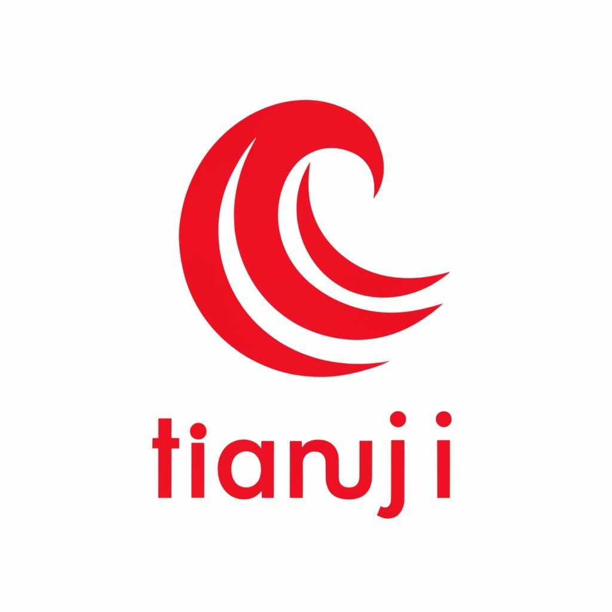

# 天机 Tianji

<p align="center">
    
<br>
<p align="center">
    &nbsp<a href="README.md">中文</a>&nbsp ｜ &nbsp<a href="README_en.md">English</a>&nbsp ｜ &nbsp<a href="README_jp.md">日本語</a>
<p align="center">
   <a href="https://python.org/" target="_blank"></a>
   <a href="https://github.com/tatsu-lab/stanford_alpaca/blob/main/LICENSE"></a>
   <br/>
</p>

Tianji is a free, non-commercial artificial intelligence system. You can utilize it for tasks involving worldly wisdom, such as "art of conversation," to enhance your emotional intelligence and core competitiveness. We firmly believe that worldly wisdom are the future core competency of AI, and let us join hands to witness the advent of general artificial intelligence.

## What You Will Learn in Tianji 🍉

- Build [prompt](./tianji/prompt/gpt_prompt/) dialogue [large model applications](./run/tianji_prompt_webui.py)

- Create [AI games](./tianji/prompt/aigame/zhipu/) (similar to coaxing simulator) applications

- Build [intelligent agent applications](./run/metagpt_webui.py) based on [metagpt](./tianji/agents/metagpt_agents/) (to be refactored soon)

- Build a [knowledge base dialogue application](./tianji/knowledges/) from scratch (to be refactored soon)

- [Create data from scratch](./docs/finetune/how-to-get-finetune-data.md), [fine-tune](./docs/finetune/how-to-get-finetune-data.md) your own large language model

**After completing all the content, you will gain entry-level full-stack application development capabilities for large language models. 🕶️**

[SocialAI](https://socialai-tianji.github.io/socialai-web/) is a non-profit organization established in China. We have fully open-sourced the **Tianji** series of work. The current open-source system technology route involves [Prompt](tianji/prompt/yiyan_prompt), [AI games](test/prompt/aigame/zhipu), [Agent](tianji/agents), knowledge base, [model training](docs/finetune/tianji-wishes-chinese.md). For specific content, please refer to the documentation and corresponding repositories.

Based on the organized social etiquette data, the social etiquette large model system - Tianji includes seven major areas of common interpersonal communication (specific details can be found in the scenario refinement details in [Scene Classification](test/%E5%9C%BA%E6%99%AF%E5%88%86%E7%B1%BB)), which can be broadly divided into:

```
- Toasting etiquette culture Etiquette
- Hospitality etiquette culture Hospitality
- Gift-giving etiquette culture Gifting
- Sending blessings Wishes
- How to speak Communication
- Resolving "awkward" situations Awkwardness
- Dealing with conflicts & confrontations Conflict
```

Combining these areas, Tianji involves four technical routes:

- Pure prompt (including AI games): Built-in system prompt based on the large model's own ability to dialogue.
- Agent (MetaGPT, etc.): Using Agent architecture to get richer, more customized detailed answers.
- Knowledge base: Directly retrieve social etiquette rules (such as how to drink at the dinner table).
- Model training: Based on different excellent model bases, perform Lora fine-tuning or full fine-tuning when accumulating a large amount of data.

You can find the corresponding source code for the four routes in the tianji directory. If you want to refer to the project architecture, data management, and technical route of `Tianji` to recreate your own vertical domain AI application, welcome to fork or directly refer to it. We will open source all processes including `project start-up, data direction exploration, data construction and management, AI application creation from scratch, in-depth combination of domain (such as social etiquette) and technical routes`; we hope to see further acceleration of AI native applications in life.

## Table of Contents

- [News](#%F0%9F%93%B0News)
  - [Roadmap](#Roadmap)
- [Running Environment](#Running-Environment)
  - [Environment Installation](#Environment-Installation)
  - [Key Configuration](#Key-Configuration)
- [File Directory Description](#File-Directory-Description)
  - [Documentation Description](#Documentation-Description)
- [How to Run](#%F0%9F%8D%BAHow-to-Run)
  - [Examples](#Examples)
- [How to Participate in This Project](#How-to-Participate-in-This-Project)
  - [Issue Board](#Issue-Board)
  - [Submit Your First PR](#Submit-Your-First-PR)
- [How to Replicate This Project](#How-to-Replicate-This-Project)
- [Contributors](#Contributors)
- [Acknowledgements](#Acknowledgements)

## 📰News

- **\[2024.07.14\]** Updated the new [Sending Blessings module](https://openxlab.org.cn/apps/detail/tackhwa00/Tianji-Wishes) supporting more style switches, data open-sourced to [huggingface](https://huggingface.co/datasets/sanbu/tianji-chinese/blob/main/tianji-wishes-chinese-v0.1.json)

- **\[2024.05.04\]** 🚀 We released a [fine-tuning data acquisition and production tutorial](https://github.com/SocialAI-tianji/Tianji/blob/main/docs/finetune/how-to-get-finetune-data.md) using "Resolving Awkward Situations" as an example, with corresponding data open-sourced to [huggingface](https://huggingface.co/datasets/sanbu/tianji-chinese/tree/main)

- **\[2024.05.02\]** 🚀 We released a [fully reproducible document](./docs/finetune/tianji-wishes-chinese.md) on the entire process from data collection to fine-tuning for the social etiquette large model - Sending Blessings, along with corresponding [data](https://huggingface.co/datasets/sanbu/tianji-chinese/tree/main), [configuration](./tianji/finetune/xtuner/internlm2_chat_7b_qlora_oasst1_e3_copy.py), and [auxiliary scripts](./tools/finetune/README.md). (We were away for a while but are back now, mainly due to the main maintainer's continuous overtime work, only able to happily open source during holidays)

- **\[2024.02.01\]** 🧑‍🚀 We released initial experience addresses for [prompt](http://120.76.130.14:6006/prompt/), [Agent applications](http://120.76.130.14:6005/), knowledge base(TODO), and [model fine-tuning (based on InternLM2)](https://openxlab.org.cn/apps/detail/tackhwa00/Tianji-Wishes), and made the repository open.

### Roadmap

- \[x\] Release the simplest initial version (involving prompt, aigame, agent, knowledge base, model fine-tuning)
- \[x\] Complete the reproducible documentation of the model fine-tuning data collection to fine-tuning process for [Social Etiquette Large Model - Sending Blessings](https://openxlab.org.cn/apps/detail/jujimeizuo/tianji-wish)
- \[x\] Open-source social etiquette corpus - Sending Blessings to huggingface
- \[x\] Iterate better data production tools and cleaning solutions, open-source data cleaning scripts
- \[ \] Complete knowledge base part iteration
- \[ \] Complete Agent part documentation
- \[ \] Open knowledge base corpus acquisition details to huggingface
- \[ \] Add documentation (how to build your own application prompt, agent, knowledge base, fine-tuning application by referencing this project)
- \[ \] Organize multi-dimensional data, open-source relatively complete social etiquette corpus
- \[ \] Collect & open-source social etiquette corpus - 20,000 and train to give results and the entire process

## Running Environment

### Environment Installation

In this project, execute the following commands to install the project's complete requirements:

```
pip install -r requirements.txt
pip install .
```

### Key Configuration

To ensure the project runs normally, **please create a new `.env` file in the project and set your API keys in it**. You can write the corresponding keys according to the following example to successfully run the call. Currently, zhipuai is used by default, so you can just write `ZHIPUAI_API_KEY` to use it.

If you encounter extremely slow or unable to download issues when downloading models from Hugging Face, please set the value of `HF_ENDPOINT` to `https://hf-mirror.com` in the .env file. Please note that some Hugging Face repositories may require access permission (e.g., Jina Ai). For this, please register a Hugging Face account and add `HF_TOKEN` in the .env file. You can find and obtain your token [here](https://huggingface.co/settings/tokens).

```
OPENAI_API_KEY=
OPENAI_API_BASE=
ZHIPUAI_API_KEY=
OPENAI_API_MODEL=
HF_HOME='./cache/'
HF_ENDPOINT = 'https://hf-mirror.com'
HF_TOKEN=
```

## File Directory Description

```
assets/: Static image files
run/: Includes various demonstration frontends
test/: This contains test files for various functions, including core modules and llm runtime unit tests
tianji/: Source code directory, containing main logic and algorithm implementations
tools/: Tools to help collect data, organize data cleaning corpus
```

### Documentation Description

TODO, to cover all documentation

## 🍺How to Run

The following provides the application methods for prompt and agent. Before running, please make sure you have created a `.env` file:

```bash
# Run prompt webui frontend
python3 run/tianji_prompt_webui.py

# Run agent frontend
streamlit run run/metagpt_webui.py
```

## Examples

### Fine-tuning - Blessing Module

The current blessing module supports three modes of triggering:

Normal style, directly write the blessing recipient, conforming to common conversation patterns.
Xiaohongshu style, can be triggered by adding "Xiaohongshu style" after specifying the blessing recipient; comes with emojis and cute conversation style.
Serious style, can be triggered by adding "serious style" after specifying the blessing recipient; formal writing style.


### Prompt - How to Make a Toast

Here's a dialogue example of Tesla founder Elon Musk toasting to OpenAI founder Sam Altman (generated based on built-in prompts):

```
elon musk: Sam, your Openai should be called CloseAI instead
sam altman: You better manage your grok first, I'm punishing you with three drinks!
elon musk: Look at what you're saying, do you want me to finish this bottle of baijiu?
sam altman: Haha, Elon, you're a man aiming for the stars and seas, what's a bottle of baijiu? I heard you even dare to drink rocket fuel at SpaceX parties! Come on, I'll finish this glass, you do as you please, but don't lose the dignity of the world's richest man!
elon musk: You're challenging me, brother Sam! Well, I won't be polite then, I'll drink it, you take half a glass. But speaking of which, OpenAI's achievements aren't just about boasting, you better keep an eye on it, don't let it really become "CloseAI".
sam altman: Hey, I'm always ready to take off this CEO hat and let you wear it, old Musk. But tonight, let's forget about all that, come on, let's toast to our friendship! I'll finish it, you do as you please, but remember, we still have to continue changing the world tomorrow!
elon musk: Alright, just for your "changing the world" phrase, I'll finish this glass! But don't think I'll let you off easily, wait until I bring my Tesla charging pile next time, see how you deal with that!
sam altman: Haha, I'm looking forward to that day! But for now, let's enjoy tonight. Come on, last glass, I'll finish it, you do as you please, drink happily, don't forget, OpenAI's AIs are still waiting for us to go back and continue training them!
```

### Knowledge Base - xxx

TODO

## How to Participate in This Project

### Issue Board

[Here](https://github.com/SocialAI-tianji/Tianji/issues/31) records some issues existing in this project (welcome to solve them), as well as some roadmap that needs to be completed in the future. Currently, there's no time to write, if you have time and want to play together, please issue or contact me directly via email: physicoada@gmail.com

### Submit Your First PR

Thanks to good ci facilities, you only need to refer to the [example PR](https://github.com/SocialAI-tianji/Tianji/pull/27) to quickly propose your first prompt PR!
After submitting the PR, the new prompt will be automatically merged into the json file under `tianji/prompt`, convenient for one-click calling. If you don't know what to write, you can refer to the various scenario refinement details in [Scene Classification](test/%E5%9C%BA%E6%99%AF%E5%88%86%E7%B1%BB) to write prompts for different social etiquette domains.

## How to Replicate This Project

The initial intention of this project is, first, to make `AI learn core technology`, and second, to allow more people (domains/industries) to build their own AI systems, accelerating AI's penetration into every field. You can learn about this project through the following ways:

You can refer to this project to create new vertical domain applications:

- Rental assistant (agent)
- Childcare assistant (data collection and knowledge base)
- Life guide (data collection and knowledge base)
  ......

## Contributors

<a href="https://github.com/eryajf/learn-github/graphs/contributors">
  
</a>

[Some contributors don't have GitHub, we thank each and every contributor!](docs/contributor.md), and welcome you to join!

## Acknowledgements

Thanks to all the following people for their help with this project:

- All contributors
- Powerful [Zhipu AI](https://open.bigmodel.cn/) for token support! (Currently, except for fine-tuning, all base models are based on Zhipu AI)
- Shanghai Artificial Intelligence Laboratory [InternLM Model](https://github.com/InternLM/InternLM), and the provided A100 GPU resources!
- [InternLM Series Open Source Tutorials (currently one of the best LLM practical full-stack tutorials)](https://github.com/InternLM/tutorial)
- [Datawhale Open Source Learning Community](https://github.com/datawhalechina)
- [Qixiang Planet](https://1aigc.cn/)

## Star History


